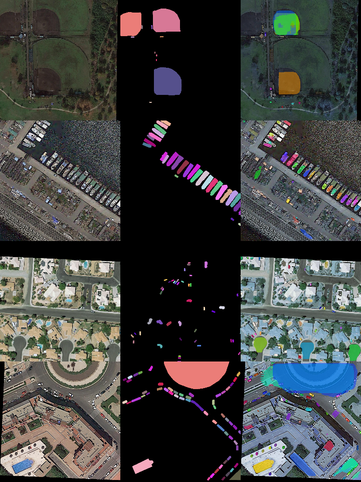

# Custom_Train_MaskRCNN


### Reference
```https://github.com/miki998/Custom_Train_MaskRCNN```

Training on custom dataset with (multi/unique class) of a Mask RCNN

### Requirements (No specific version)
```
  python3
  pycocotools
  matplotlib
  mrcnn
  tqdm
  numpy
  pylab
  skimage

```


### DataSet
The images of iSAID is the same as the DOTA-v1.0 dataset, which are manily collected from the Google Earth, some are taken by satellite JL-1, the others are taken by satellite GF-2 of the China Centre for Resources Satellite Data and Application

The object categories in iSAID include: plane, ship, storage tank, baseball diamond, tennis court, basketball court, ground track field, harbor, bridge, large vehicle, small vehicle, helicopter, roundabout, soccer ball field and swimming pool.
The annotation follows the format of MS COCO.

```https://captain-whu.github.io/iSAID/dataset.html```

### Preprocessing the dataset
```https://github.com/CAPTAIN-WHU/iSAID_Devkit```

Note: installation for mrcnn will be explained in the medium article linked in the Original repo.

### Structure
- dataset: folder where you put the train and val folders (read inside to know what to put)
- logs: folder where we store the intermediate/checkpoints and final weights after training
- weights: weights for the model, we fetch the weights from here for the test script
- detect_segment_test.py: test script for the segmentation, displays mask on top of input image, usage given by --h argument
- train.py: main script for this section, read medium article to know what to modify

### Pre-Tranined Model
```https://drive.google.com/file/d/1RcFQPJhFOTE3P8c9akZILLSniahXvDqc/view?usp=sharing```

### Inference 
- First Image is the original Image, Secondis the True Mask and the right image is the model generated output.

