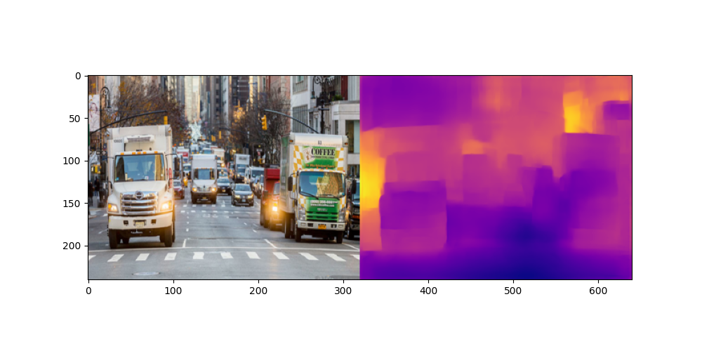
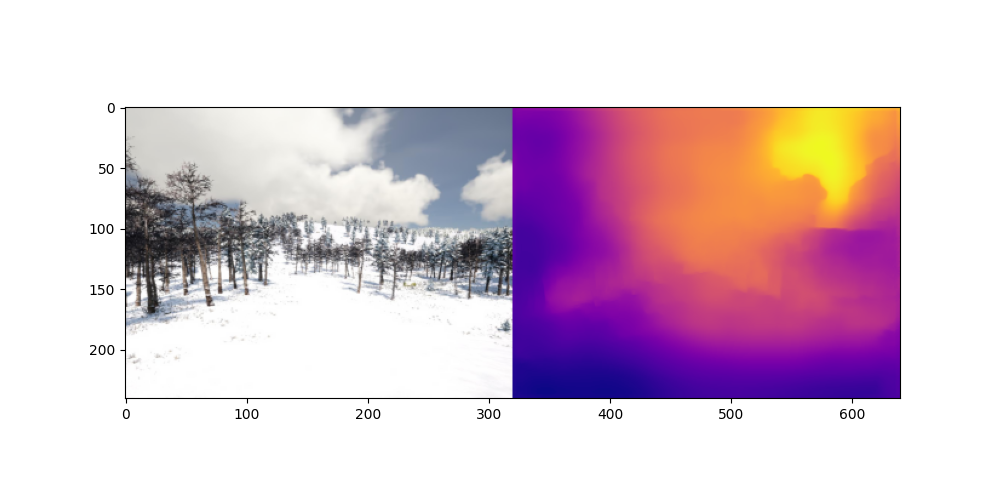

## Monocular Depth Estimation via Transfer Learning

- Trained Densedepth model on NYU dataset, using Densenet169 pretrained on Imagenet dataset as the Encoder.

## Requirements
* This code is tested with Keras 2.2.4, Tensorflow 1.13, CUDA 10.0, on a machine with an NVIDIA Titan V and 16GB+ RAM running on Windows 10 or Ubuntu 16.
* Other packages needed `keras pillow matplotlib scikit-learn scikit-image opencv-python pydot` and `GraphViz` for the model graph visualization and `PyGLM PySide2 pyopengl` for the GUI demo.
* Minimum hardware tested on for inference NVIDIA GeForce 940MX (laptop) / NVIDIA GeForce GTX 950 (desktop).
* Training takes about 24 hours on a single NVIDIA TITAN RTX with batch size 8.


## Pre-trained Models
* [NYU Depth V2](https://s3-eu-west-1.amazonaws.com/densedepth/nyu.h5) (165 MB)

## Data
* [NYU Depth V2 (50K)](https://tinyurl.com/nyu-data-zip) (4.1 GB): You don't need to extract the dataset since the code loads the entire zip file into memory when training.

## Training
* Run `python train.py --data nyu --gpus 1 --bs 2`.

## Reference
Corresponding paper to cite:
```
@article{Alhashim2018,
  author    = {Ibraheem Alhashim and Peter Wonka},
  title     = {High Quality Monocular Depth Estimation via Transfer Learning},
  journal   = {arXiv e-prints},
  volume    = {abs/1812.11941},
  year      = {2018},
  url       = {https://arxiv.org/abs/1812.11941},
  eid       = {arXiv:1812.11941},
  eprint    = {1812.11941}
}
``` 
### Inference

Model was trained on indoor images of NYU dataset for eight epochs. It is performing quite good on the scenarios that weren't included in the training set.
- Following Image is the model prediction on outdoor city driveway image


- Models prediction on Image from Midair dataset

